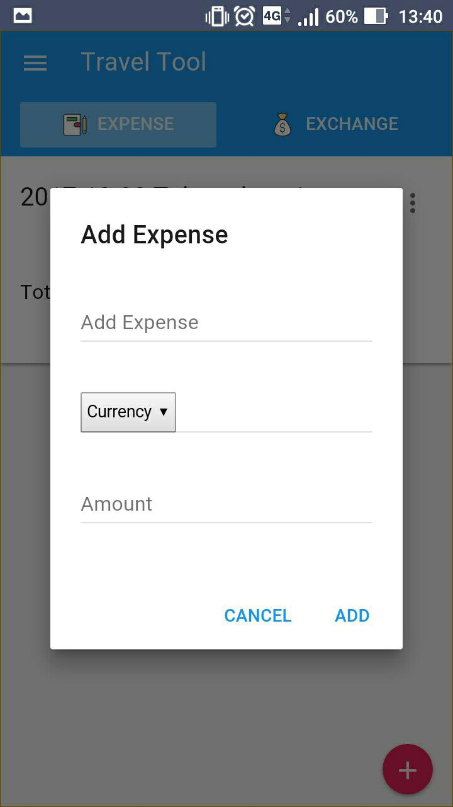

# Travel-tool

- [Try it now!](https://benjaminchen.github.io/travel-tool/)
- QR Code   

## Introduction

This is a simple web application. It has two functions: recording expenses and currency converting. It helps you record your expenses in every trip and convert currency anytime anywhere. But remeber it use web storage to save your data. If you reset the browser or clear browsing  data, your datas will be gone.

## Usage

### Setting

### Recording expenses

### Converting currency

